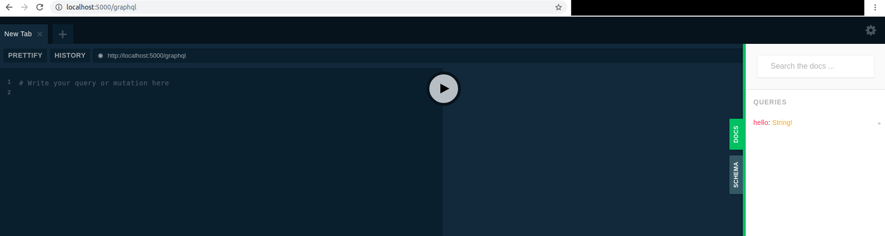

## Motivation

blueprint to implement a flask application that host graphql api using [`Ariadne`](https://ariadnegraphql.org/).
This application may be used to:

* build Graphql API application
* build Hybrid API application with Graphql endpoint and Rest endpoints
* ...


*take a look on http://localhost:5000/graphql*

A graphql API allow the client to query only data it need. A contract will be specified between
the client and the server through graphql schema.

Ariadne is a schema-first framework. It requires you specify graphql schema to bind ``resolver`` on
it. The configuration is straight forward. To fetch data, we will specify ``Query``. To modify data, we will
specify ``Mutation``. Graphql is type based API.

For Ariadne, the `resolver` is the equivalent of `Controller` in MVC pattern. It will take a part of a query and send
back the requested answer. Ariadne will internally glue the answers from all the resolvers involved in a Query.

### Going further

I have done a more advanced study about 2 graphql engine (Ariadne, Graphene), the link between ORM and graphql with Ariadne and SqlAlchemy and
the usage of advanced proxy to perform graphql federation with Apollo Server and Ariadne in 4 spikes :

* [https://github.com/FabienArcellier/spike-ariadne](https://github.com/FabienArcellier/spike-ariadne)
* [https://github.com/FabienArcellier/spike-graphene-flask](https://github.com/FabienArcellier/spike-graphene-flask)
* [https://github.com/FabienArcellier/spike-orm-python-typescript](https://github.com/FabienArcellier/spike-orm-python-typescript)
* [https://github.com/FabienArcellier/spike-apollo-federation](https://github.com/FabienArcellier/spike-apollo-federation)

## Getting started

### System requirements

The following requirements has to be setup on your host before running the command
from this repository.

* `python 3.6` at least
* [pipenv](https://pipenv.pypa.io/en/latest/)

### Install the python dependencies

```bash
make install_requirements_dev
make start
```

## The latest version

You can find the latest version to ...

```bash
git clone git@github.com:FabienArcellier/blueprint-webapp-flask.git
```

## Usage

You can run the application with the following command

```python
make start
```

### Usage for production

This blueprint use ``gunicorn`` as wsgi server for production configuration.
The command is set in the Procfile to be available on PaaS environment as ``Heroku`` or ``Scalingo``.

```bash
pipenv run prod
```

## Contributing

### Install development environment

Use make to instanciate a python virtual environment in ./venv3 and install the
python dependencies.

```bash
make install_requirements_dev
```

### Freeze the library requirements

If you want to freeze all the packages, use
this procedure

```bash
make update
```

### Activate the python environment

When you setup the requirements, a `venv3` directory on python 3 is created.
To activate the venv, you have to execute /

```bash
make activate
```

### Run the linter and the unit tests

Before commit or send a pull request, you have to execute pylint to check the syntax
of your code and run the unit tests to validate the behavior.

```bash
make lint
make tests
```

## Contributors

* Fabien Arcellier

## License

A short snippet describing the license (MIT, Apache, etc.)
